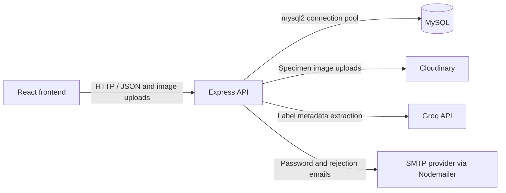

# Karachi University Herbarium

A web application for browsing botanical specimens and managing botanist-submitted herbarium records.

[](https://react.dev/)
[](https://vite.dev/)
[](https://expressjs.com/)
[](https://www.mysql.com/)

## Overview

Karachi University Herbarium  provides a searchable web interface for herbarium specimen records, alongside application and review workflows for botanists and administrators. It is intended for people exploring botanical collections, botanists submitting specimen metadata, and administrators managing access and reviewing records.

The implemented workflow lets an applicant request botanist access, an administrator review the application, and an approved botanist submit records for review. Public visitors can browse the herbarium and plant records. The API also includes image-based extraction of specimen-label metadata to help populate a submission form.

## Features

### Public

- Browse plant and herbarium records, with taxonomy and collection details.
- View informational pages for About, Faculty and Staff, and Contact.
- Submit a botanist application and request a password reset.

### Botanist

- View a dashboard and profile.
- Create manual or AI-assisted specimen submissions, save drafts, and view submissions.
- Upload specimen images as part of a submission.

### Administrator

- Review and approve or reject botanist applications.
- Review and approve or reject specimen submissions.
- View dashboard metrics and browse herbarium records.
- List users and activate or deactivate accounts through backend endpoints.

## Tech Stack

| Category | Technologies confirmed in project code |
| --- | --- |
| Frontend | React 19, Vite 7, React Router, Redux Toolkit |
| Backend | Node.js, Express 5 |
| Database | MySQL through `mysql2/promise` connection pooling |
| Authentication | JSON Web Tokens (`jsonwebtoken`), password hashing with `bcryptjs` |
| State management | Redux Toolkit |
| Styling and UI | Tailwind CSS 4, Material UI, plain CSS |
| Charts and icons | Recharts, Lucide React, React Icons, Material UI Icons |
| HTTP and media | Axios, Multer, Cloudinary, OpenSeadragon, Leaflet |
| AI and email | Groq SDK for label metadata extraction; Nodemailer for email flows |
| Deployment configuration | Vercel SPA rewrite configuration is present; no backend deployment manifest is checked in |

## System Architecture



The frontend owns page navigation, role-specific views, client state, and API requests. The Express application mounts route modules and delegates business logic to controllers and services. Middleware handles JWT verification, role authorization on selected routes, and image upload parsing. The database module provides the MySQL connection pool. Cloudinary, Groq, and SMTP are used for media, AI-assisted label extraction, and email respectively.

## Project Structure

```text
DigitalHerbarium_fyp26/
├── Backend/
│   ├── config/          # MySQL pool and Cloudinary configuration
│   ├── controllers/     # Authentication, admin, profile, plant, and submission handlers
│   ├── Middlewares/     # JWT/role checks and image upload handling
│   ├── models/          # Partial checked-in SQL schema
│   ├── routes/          # Express API route modules
│   ├── scripts/         # Admin account seeding script
│   ├── services/        # Email helpers and service modules
│   └── server.js        # Express app setup and route mounting
├── frontend/
│   ├── public/          # Static frontend assets
│   └── src/
│       ├── api/         # Axios client and API functions
│       ├── components/  # Shared UI and public/admin/botanist screens
│       ├── routes/      # Frontend route guards
│       └── store/       # Redux store and authentication state
├── package.json         # Root dependencies; no root scripts
└── README.md
```

## Installation

### Prerequisites

- Node.js and npm. The repository does not pin a Node.js version.
- A MySQL server and a database schema compatible with the backend queries.
- Service credentials for integrations used in your chosen workflows (Cloudinary, Groq, and SMTP email).

### Clone Repository

```bash
git clone https://github.com/tayyabaakh/FYP26_Digital-Herbarium.git
cd FYP26_Digital-Herbarium
```

### Install Dependencies

Install each application from its own directory:

```bash
cd Backend
npm install
```

In a second terminal at the repository root:

```bash
cd frontend
npm install
```

## Environment Variables

There is no checked-in `.env.example`. Create `Backend/.env` locally and provide the variables required for the services you run. The names below are read by active backend code; values are examples/placeholders, not project credentials.

```env
# Backend listener and MySQL connection
PORT=4000
DB_HOST=localhost
DB_PORT=3306
DB_USER=your_mysql_user
DB_PASSWORD=your_mysql_password
DB_NAME=flora_digitalis

# JWT creation and verification
JWT_SECRET=replace_with_a_long_random_secret
JWT_EXPIRES_IN=7d

# Password-reset link origin
CLIENT_URL=http://localhost:5173

# First administrator only: used by npm run seed
ADMIN_NAME=Herbarium Administrator
ADMIN_EMAIL=admin@example.com
ADMIN_PASSWORD=replace_with_a_strong_password

# Specimen image uploads
CLOUDINARY_CLOUD_NAME=your_cloud_name
CLOUDINARY_API_KEY=your_cloudinary_api_key
CLOUDINARY_API_SECRET=your_cloudinary_api_secret

# AI-assisted specimen-label extraction
GROQ_API_KEY=your_groq_api_key

# SMTP email flows
EMAIL_USER=your_email@example.com
EMAIL_PASS=your_email_app_password
EMAIL_HOST=smtp.gmail.com
EMAIL_PORT=587
```

`PORT` defaults to `4000`; `JWT_EXPIRES_IN` defaults to `7d`; and `CLIENT_URL` defaults to `http://localhost:5173`. `EMAIL_HOST` and `EMAIL_PORT` default to `smtp.gmail.com` and `587` in the reset-email service. Set `DB_PORT` explicitly: the current database configuration falls back to `4000` when it is omitted, which is not the usual MySQL port.

The frontend API client reads `VITE_API_URL`, for example `VITE_API_URL=http://localhost:4000/api`, but `frontend/src/api/api.js` currently declares a second `baseURL` value pointing to localhost after that environment-based value. The latter takes precedence. As a result, setting `VITE_API_URL` alone currently does not configure the shared API client for a different host. Password-reset screens and the admin dashboard also contain direct localhost API URLs.

Keep `.env` files and all credentials out of version control.

## Database Setup

The backend uses MySQL via `mysql2/promise`, configured as a connection pool. Create the database and user, then provision the full schema expected by the controllers. For example, database creation can start with:

```sql
CREATE DATABASE flora_digitalis CHARACTER SET utf8mb4 COLLATE utf8mb4_unicode_ci;
```

The repository does **not** contain a complete schema or data dump. `Backend/models/user.sql` is partial: its active statements select the database `test`, drop `users`, and define `users` and `botanist_applications`; it does not define `botanist_submissions` or `herbarium_data`. Some active controller queries also expect columns not present in those checked-in table definitions. Do not run this SQL file against a database containing data. Verify and provision the schema used by your environment before running the application.

The `users` table defines account identity, role, activation state, and timestamps. `botanist_applications` contains applicant and qualification data and a foreign key to `users.id` with `ON DELETE CASCADE`. Submission and published herbarium tables are used by the API, but their DDL is not included.

To create an administrator, configure `ADMIN_NAME`, `ADMIN_EMAIL`, `ADMIN_PASSWORD`, and `JWT_SECRET`, then run from `Backend/`:

```bash
npm run seed
```

The seed script checks for an existing admin before inserting one. The database schema must already provide the columns used by the script.

## Running the Project

Start the backend in one terminal:

```bash
cd Backend
npm run dev
```

The backend uses `nodemon` in development and listens on port `4000` by default. Its health endpoint is `GET /`.

Start the frontend in another terminal:

```bash
cd frontend
npm run dev
```

Vite prints the local development URL, typically `http://localhost:5173`.

Available frontend scripts, defined in `frontend/package.json`:

```bash
npm run build
npm run lint
npm run preview
```

Available backend scripts, defined in `Backend/package.json`:

```bash
npm start
npm run dev
npm run seed
```

## API Documentation

Unless noted otherwise, routes are mounted under `/api`. Protected routes expect `Authorization: Bearer <token>`. The tables below describe registered paths; they do not imply the incomplete checked-in database schema is sufficient to run every handler.

### Authentication

| Method | Endpoint | Access | Description |
| --- | --- | --- | --- |
| `POST` | `/api/auth/apply` | Public | Submit a botanist application |
| `POST` | `/api/auth/login` | Public | Authenticate a user |
| `GET` | `/api/auth/me` | JWT required | Return the authenticated user's profile |
| `POST` | `/api/auth/forgot-password` | Public | Request a password-reset email |
| `POST` | `/api/auth/reset-password/:token` | Public | Reset a password using a token |

### Botanist and Profile

| Method | Endpoint | Access | Description |
| --- | --- | --- | --- |
| `GET` | `/api/botanist/dashboard` | JWT required | Return botanist dashboard data |
| `POST` | `/api/submissions` | JWT required; botanist handler | Create a specimen submission; accepts an optional `image` upload |
| `POST` | `/api/submissions/draft` | JWT required; botanist handler | Save a submission draft |
| `GET` | `/api/submissions/my` | JWT required; botanist handler | List the current user's submissions |
| `GET` | `/api/profile/me` | JWT required | Read the current profile |
| `PUT` | `/api/profile/me` | JWT required | Update the current profile |
| `PATCH` | `/api/profile/settings` | JWT required | Settings route; current handler does not persist settings |

### Public Plant and AI Routes

| Method | Endpoint | Access | Description |
| --- | --- | --- | --- |
| `GET` | `/api/plants` | Public | List plant records |
| `GET` | `/api/plants/:id` | Public | Get a plant by specimen identifier |
| `GET` | `/api/herbarium` | Public | Browse/filter herbarium records |
| `POST` | `/api/ai/identify` | Public | Extract label metadata from an uploaded image using Groq |

### Administration and Review

| Method | Endpoint | Access | Description |
| --- | --- | --- | --- |
| `GET` | `/api/admin/applications` | Admin | List applications; supports a `status` query filter |
| `GET` | `/api/admin/applications/:id` | Admin | Read an application |
| `PUT` | `/api/admin/applications/:id/approve` | Admin | Approve an application |
| `PUT` | `/api/admin/applications/:id/reject` | Admin | Reject an application |
| `DELETE` | `/api/admin/applications/:id` | Admin | Delete an application |
| `GET` | `/api/admin/users` | Admin | List users |
| `PUT` | `/api/admin/users/:id/deactivate` | Admin | Deactivate a user |
| `PUT` | `/api/admin/users/:id/activate` | Admin | Activate a user |
| `GET` | `/api/admin/dashboard-stats` | **No auth middleware** | Return dashboard metrics, trends, and pending actions |
| `GET` | `/api/submissions/admin/all` | Admin | List submissions for review |
| `PUT` | `/api/submissions/admin/approve/:id` | Admin | Approve a submission |
| `PUT` | `/api/submissions/admin/reject/:id` | Admin | Reject a submission |

The backend also serves files under `/uploads/*` as static content; this route is mounted outside the `/api` prefix.

## Authentication & Authorization

- The login handler verifies account passwords using `bcryptjs` and issues JWTs signed with `JWT_SECRET`.
- The frontend stores the JWT and serialized user in `localStorage`. Its Axios request interceptor attaches the token as a bearer authorization header.
- On application startup, the frontend requests the current user when a stored token exists. The backend `protect` middleware verifies the token and checks that the account still exists and is active.
- `authorizeRoles` checks roles on administrator application, user-management, and submission-review routes. Frontend route guards also restrict admin and botanist page areas.
- Botanist application and login are public endpoints. Application approval changes account access in the application workflow.

The admin dashboard stats route is an exception: it is registered without `protect` or `authorizeRoles`. It should not be treated as an administrator-only endpoint in the current implementation.

## Application Workflow

```text
Applicant submits botanist application
              ↓
Administrator reviews application
        ┌─────┴─────┐
     Rejected    Approved
                    ↓
          Botanist submits a record
                    ↓
       Administrator reviews submission
        ┌───────────┴───────────┐
     Rejected                Approved
                                ↓
                  Record added to herbarium data
```

This describes the intended source-code workflow. A deployment needs the complete, compatible database schema for these operations; the repository's partial SQL file is not sufficient to initialize it.


## API / Backend Architecture

- `routes/` maps HTTP paths to middleware and controller handlers.
- `controllers/` contains authentication, botanist application, submission, profile, herbarium, plant, and dashboard request logic.
- `Middlewares/` contains JWT verification, role authorization, and image upload configuration.
- `routes/aiRoutes.js` calls Groq for specimen-label metadata extraction; `services/` contains email delivery helpers.
- `config/db.js` creates the MySQL connection pool; `config/cloudinary.js` configures image hosting.
- `scripts/seedAdmin.js` creates the initial administrator account.

## Security

- Passwords are hashed and compared with `bcryptjs` in the authentication flow.
- JWTs are verified by backend middleware; protected requests also check the account's current active state.
- Selected API routes use role authorization middleware.
- SQL statements in the reviewed controllers use `mysql2` parameter placeholders for user-supplied values.
- CORS is configured with an explicit frontend-origin allowlist in `Backend/server.js`.
- Submission image uploads allow JPG, PNG, and WEBP and are limited to 5 MB by the shared upload middleware. The AI extraction route has a separate 20 MB limit.
- Credentials are read from environment variables in application code.

The admin dashboard metrics endpoint does not currently use authentication middleware. CORS is not a substitute for API authorization.

## Error Handling

The backend returns a JSON 404 response for unmatched routes and a generic JSON 500 response from its final error middleware. Controllers also handle errors for their own operations. The frontend Axios response interceptor clears stored auth state and redirects to `/login` on HTTP 401 responses, except for login requests, whose errors are left to the login flow.

## Deployment

`frontend/vercel.json` configures a Vercel rewrite to `index.html` for client-side routes. The repository does not include a backend-specific deployment manifest or automated deployment workflow. `Backend/server.js` uses `PORT` when set and otherwise listens on port `4000`.

The source references a Vercel frontend origin in the backend CORS allowlist and a Render API URL in the frontend API client. These are code-level configuration references, not proof that either deployment is currently available. In the API client, the later localhost `baseURL` currently takes precedence over the Render URL and `VITE_API_URL`.

## Testing

Automated tests are not currently included in the repository. The frontend provides `npm run lint` and `npm run build` scripts; no test script is declared in either application package.

## Future Improvements

- Add complete, non-destructive database migrations/schema and seed data for every table used by the API.
- Resolve the frontend API URL configuration and make CORS origins environment-configurable.
- Protect the admin dashboard stats endpoint with JWT and admin-role middleware.
- Add automated tests for authentication, role permissions, and application/submission review workflows.

## Contributing

Contributions can follow the standard fork-and-pull-request workflow:

1. Fork the repository and create a feature branch.
2. Make and verify a focused change.
3. Commit and push the branch to your fork.
4. Open a pull request describing the change.

## License

No license has been specified in the repository.

## Author

The repository is hosted under the GitHub account [`tayyabaakh`](https://github.com/tayyabaakh). No separate author or maintainer metadata is specified in the project manifests.